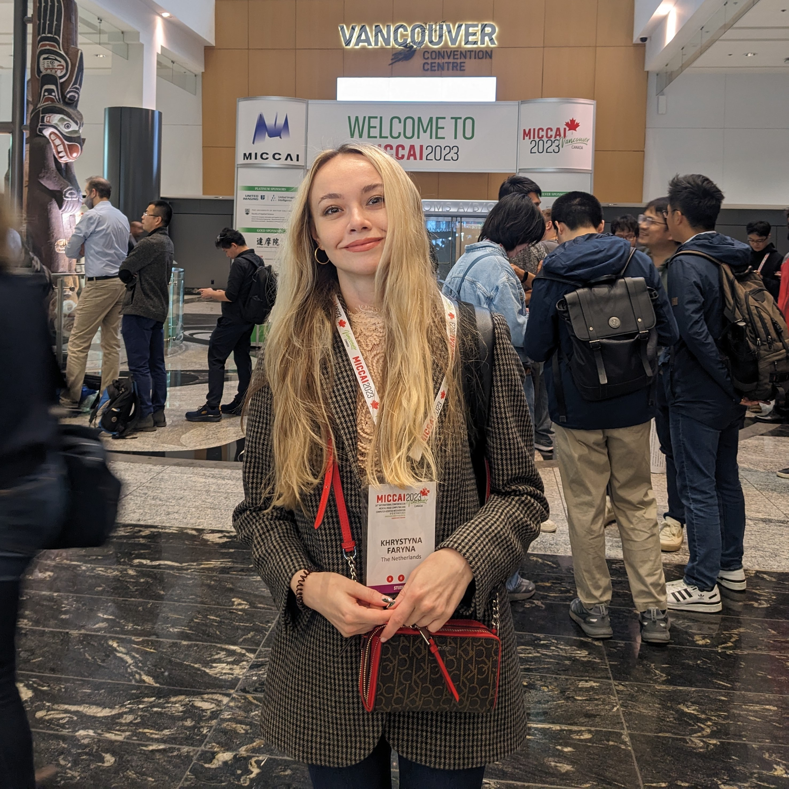

Hi, I am Khrystyna Faryna - a PhD researcher working on deep learning-based medical image analysis with the Computational Pathology Group (CPG), under the supervision of Geert Litjens and Jeroen van der Laak. In 2017, I obtained a BSc in Physics from Taras Shevchenko National University of Kyiv, Ukraine. In 2020, I obtained a Joint MSc in Medical Imaging and Applications (MaIA) from the University of Girona (Spain), UNICAS (Italy) and the University of Bourgogne (France), as a recipient of the European Union: Erasmus+ EMJMD scholarship. My past affiliations also include Middle East Technical University (Turkey) and the Carl E. Ravin Advanced Imaging Laboratories at Duke University Medical Center (USA).

[{ width=50% }
](https://www.linkedin.com/in/kfaryna/) [{ width=50% }
](https://github.com/KhrystynaFaryna) [{ width=50% }
](https://scholar.google.com/citations?user=AxwdnoMAAAAJ&hl=en) + add an image to the tab

[Link to another page](./another-page.html).

# PROJECTS

# BLOGS 

# WORKSHOPS, TALKS & AFFILIATIONS
  - **Grand-challenge.org** - technical support team member, as well as creating tutorials, blog-posts, and co-organizing workshops to facilitate workflow of deep learning challenges and algorithms on [grand-challenge.org](https://grand-challenge.org/) platform.

  - **Organizing a medical imaging challenge in 2020s** - main author of a [tutorial](https://continualmedai.github.io/daicow2023/) at MICCAI Educatinal Challenge 2023. 

  - **Dynamic AI in the Clinical Open World (DIACOW)** - co-organizer of a [continual learning tutorial](https://continualmedai.github.io/daicow2023/) at MICCAI 2023. Responsible for the histopathology part.
  
  - **AI assisted Gleason grading "in the wild"** - co-organizer of an interactive workshop at the Computational Pathology Symposium.

  - **Workshops4Ukraine** - organized 2 Pytorch workshops (*Convolutional Neural Networks in detail* and *Image segmentation using deep learning*) in the framework of a [crowdsourcing initiative](https://sites.google.com/view/dariia-mykhailyshyna/main/r-workshops-for-ukraine).  

# PUBLICATIONS

- Faryna, K., van der Laak, J., Litjens, G., “Automatic data augmentation to improve generalization of deep learning in H&E stained histopathology”, Computers in Biology and Medicine, 2024
  
- Faryna, K., van der Laak, J., Litjens, G., “Tailoring automated data augmentation to H&E-stained histopathology”, Medical Imaging with Deep Learning, 2021
  
- Faryna, K., Koschmeider, K., van Ginneken, B., et al., “Adversarial cycle-consistent synthesis of cerebral microbleeds for data augmentation”, NeurIPS (Medical Imaging meets NeurIPS 2020 workshop), 2020
  
- Faryna, K., Tushar F. T., Hou R., Rubin G. D., Lo J. Y., “Attention-Guided Classification of Abnormalities in Semi-Structured Computed Tomography Reports”, SPIE Medical Imaging: Computer-Aided Diagnosis, 2020
  
- VM D’Anniballe, FI Tushar, Faryna, K. et al, “Multi-Label Annotation of Chest Abdomen Pelvis Computed Tomography Text Reports Using Deep Learning”, BMC Medical Informatics and Decision Making, 2022
  
- More publications available on my [Google scholar](https://scholar.google.com/citations?hl=en&user=AxwdnoMAAAAJ&view_op=list_works&gmla=AH70aAVWuGnGL3MrBS2MXpQasrHiAaWOmpGPt2QYgiAcRnc_LTnXZ3xMieS2O3PR10kqhmXDB_W45L9ucqPkSQun1C5LXx_ppcZrH7D5LgOkrMdsr5KGPSTOChJSY2wVzBHxQSW4DrZNtGKlXfW7i5gWIMUIexq0aUjkkrJFplyKVO0&sciund=15610856224343231705)...

# AWARDS & HONOURS 

